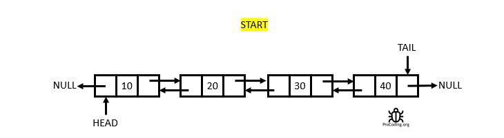
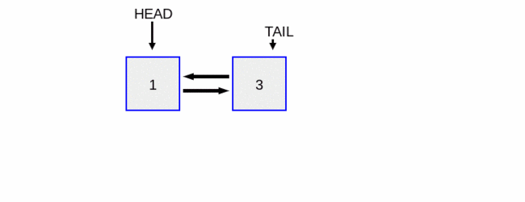
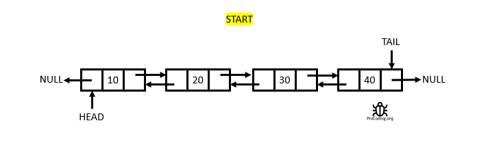

**Case 1: Empty List**
- If the list is empty:
  - Create the new node.
  - Set both its `next` and `before` pointers to null.
  - Set the head of the list to the new node.

[//]: # ([Block] Insert when the list is empty gif)

***

**Case 2: Adding to the Front**
- If you want to add a node to the front of the list:
  - Create the new node.
  - Make its `next` pointer point to the current head of the list.
  - Update the `before` pointer of the old head to point back to the new node.
  - Set the new node as the new head of the list.

[//]: # ([Block] Insert when at the start of a list gif)

***

**Case 3: Inserting Between Nodes**
- When inserting a node between two existing nodes:
  - Make the new node's `before` pointer point to the previous node.
  - Make its `next` pointer point to the next node.
  - Update the `next` pointer of the previous node to point to the new node.
  - Update the `before` pointer of the next node to point back to the new node.

[//]: # ([Block] Insert when at the middle of a list gif)

***

**Case 4: Appending at the End**
- To add a node at the end of the list:
  - Make the new node's `before` pointer point to the current last node.
  - Update the `next` pointer of the previous last node to point to the new node.
  - Set the new node as the new last node, and it should point back to the previous last node.

[//]: # ([Block] Insert when at the end of a list gif)

